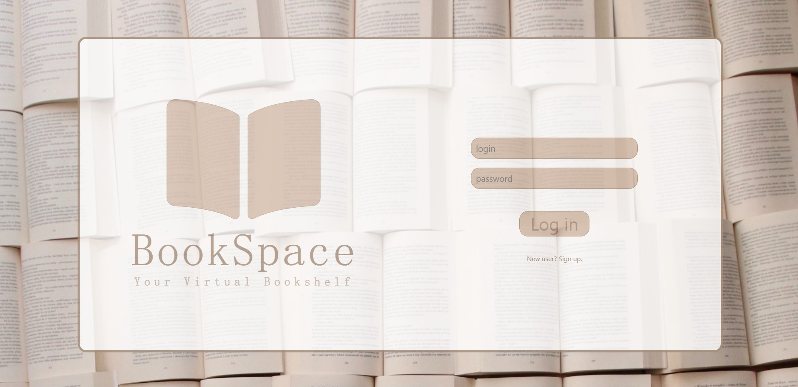
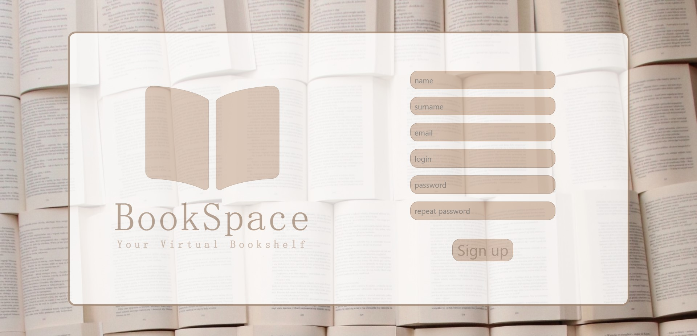
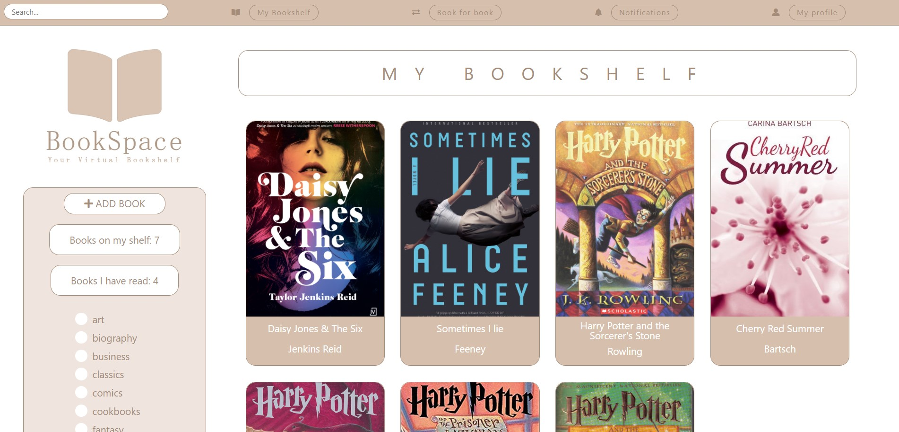
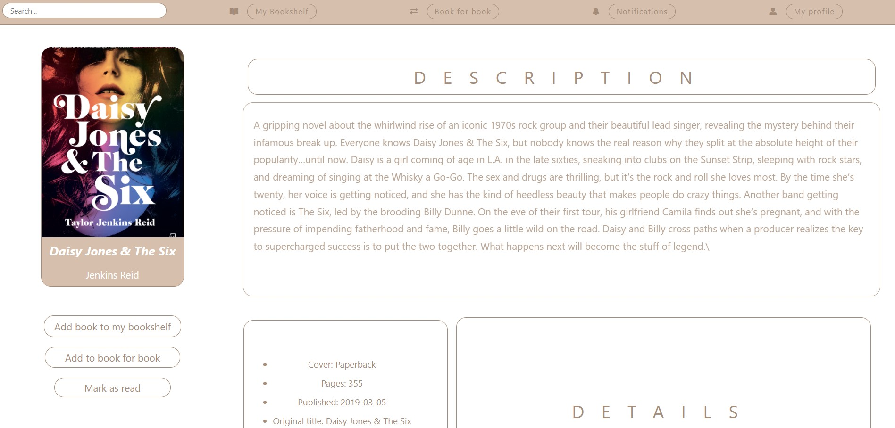
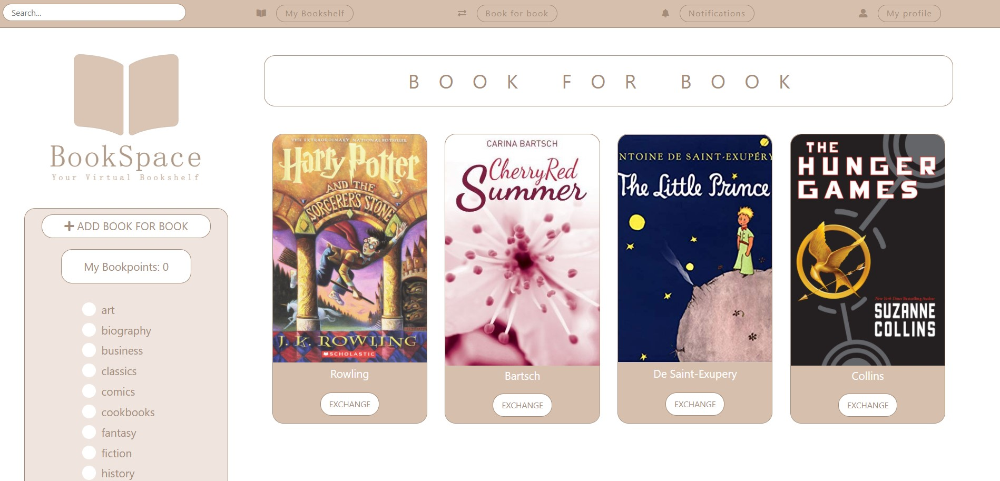
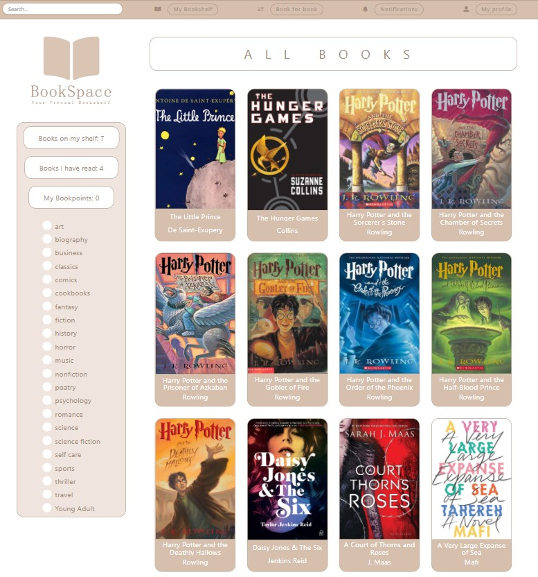
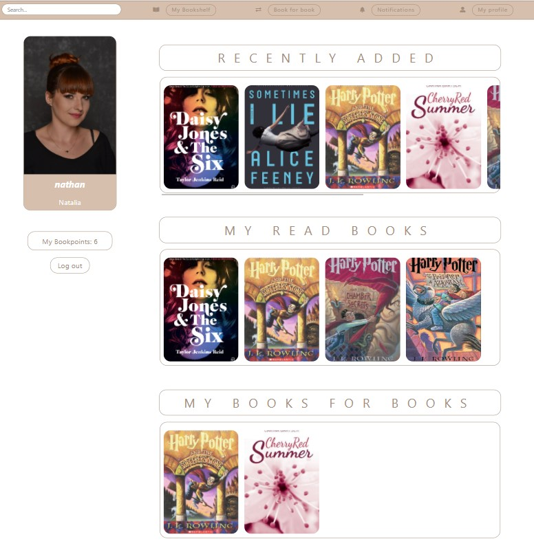
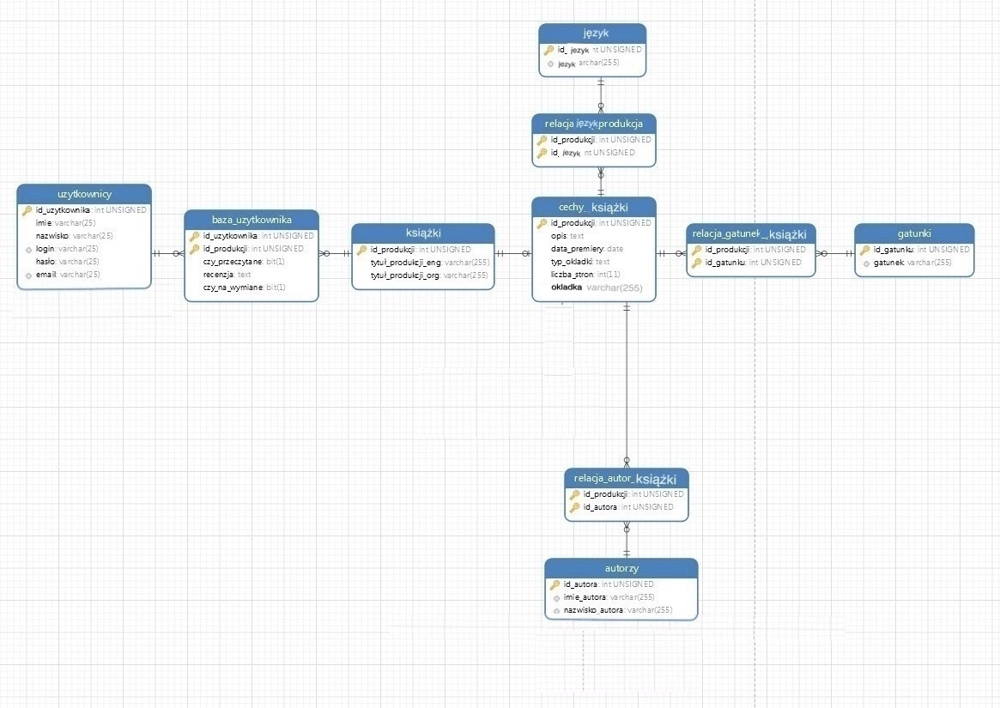

BookSpace. Your Virtual Bookshelf

It is the site for readers who want to have their virtual bookshelf. They can add books from the book database to their shelf and mark this as read. The application is suitable for expansion in terms of book exchange between users.

Login page:

Registration page:

Page with user's bookshelf:

Page with book's details:

Page with 'book for book' exchange:

Page with all books database:

Page with user's details:

ERD diagram
